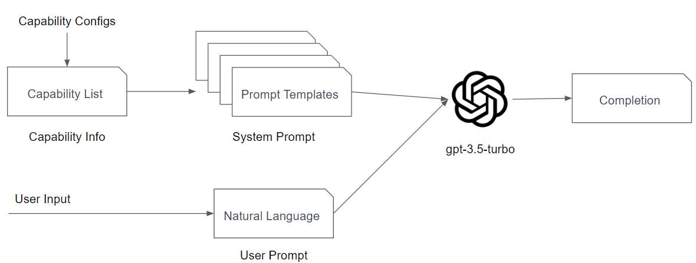
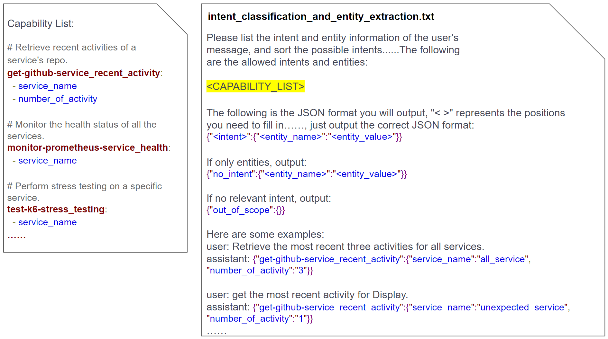

# DST (Dialogue State Tracker) for LLM (Large Language Model)

## Try DST4LLM

1. Create a Discord Application (Bot):
    - Please refer to the [step_for_DCBot](https://drive.google.com/drive/folders/1FzD0hnLN3weTTEJ5zOfrXmml8RZwRaHC?usp=sharing)
2. Clone this repository:

```bash
git clone https://github.com/sheng-kai-wang/DST4LLM.git
```

3. Create `application.properties` and `capability.yml` files:
    - you can refer to the provided templates: [application-template.properties](./src/main/resources/application-template.properties) and [capability-example.yml](./src/main/resources/capability-example.yml)
4. Then, simply execute the command:

```bash
sh build.sh
sh run.sh
```

5. Finally, send a direct message to the bot with the slash command `/lab_start` to begin using it.

## Concept

In order to reduce the workload of chatbot developers, we have designed a dialogue state tracker that integrates with OpenAI's large language model. The entire workflow analyzes the functional intent and parameter entities of user's natural language queries and executes corresponding actions, achieving `zero-shot learning`. The system automatically injects service information and capability details into the language model's prompts and enhances recognition accuracy through `In-context Learning.`

<div></div>

<br />
<br />

<div></div>

_See [all prompt tempaltes](./src/main/resources/prompts)._

<br />
<br />

<div></div>